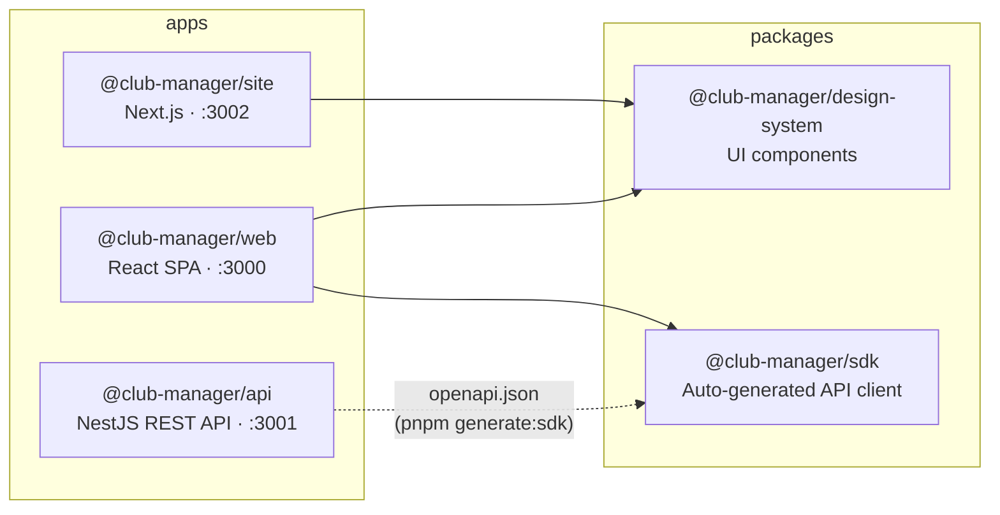
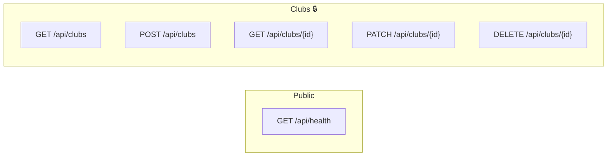
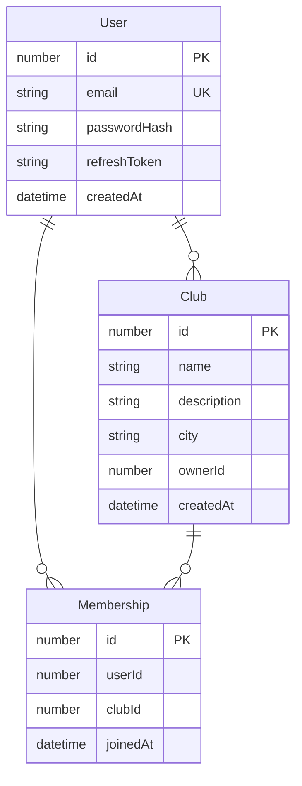
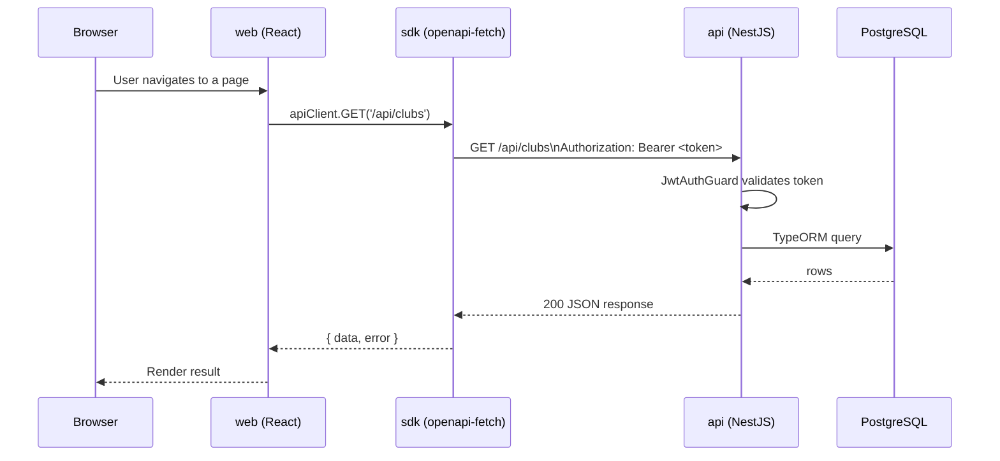

# Club Manager — Architecture Diagrams

> Auto-generated on **2026-03-21** by `scripts/update-architecture.mjs`.
> Do not edit manually — run `node scripts/update-architecture.mjs`, or just commit (the pre-commit hook handles it).

---

## 1. Workspace Dependency Graph

Who depends on whom across the monorepo.

**Key rule:** `sdk` is auto-generated from `api/openapi.json` — never edit `packages/sdk/src/schema.ts` by hand.
Regenerate with: `pnpm generate:sdk`

---

## 2. API Route Map

All REST endpoints. 🔒 = requires `Authorization: Bearer <token>`.

_6 endpoint(s) sourced from `apps/api/openapi.json`. Run `pnpm generate:sdk` after changing endpoints._

Controllers live in `apps/api/src/{auth,clubs,members}/`.
Swagger UI at `http://localhost:3001/api/docs` during development.

---

## 3. Entity-Relationship Diagram

Database models managed by TypeORM.

_Sourced from `apps/api/src/**/entities/*.ts`._

---

## 4. Request Data-Flow

End-to-end journey of a protected API call.

_This diagram is static — update it if the transport layer changes (new auth scheme, BFF, etc.)._
