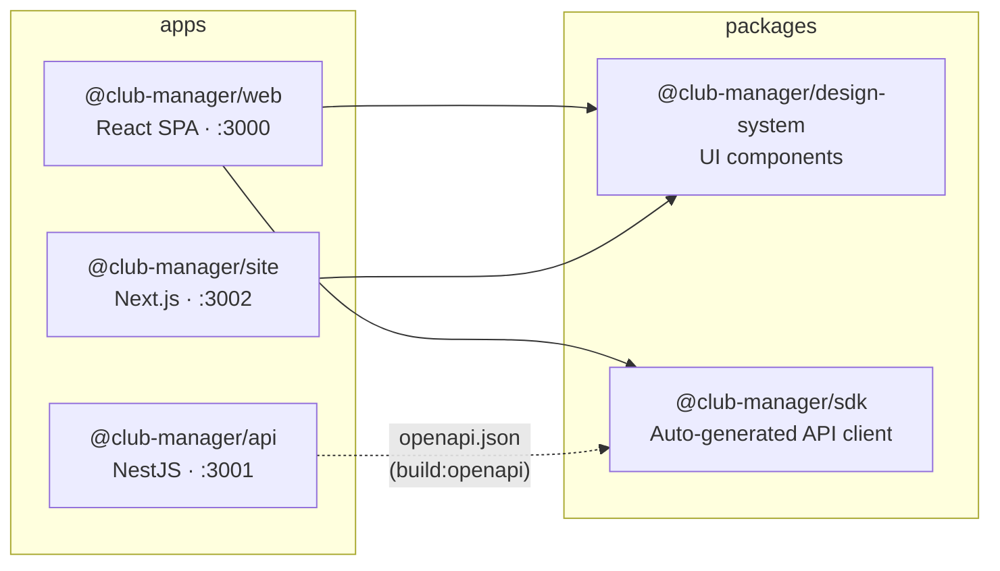
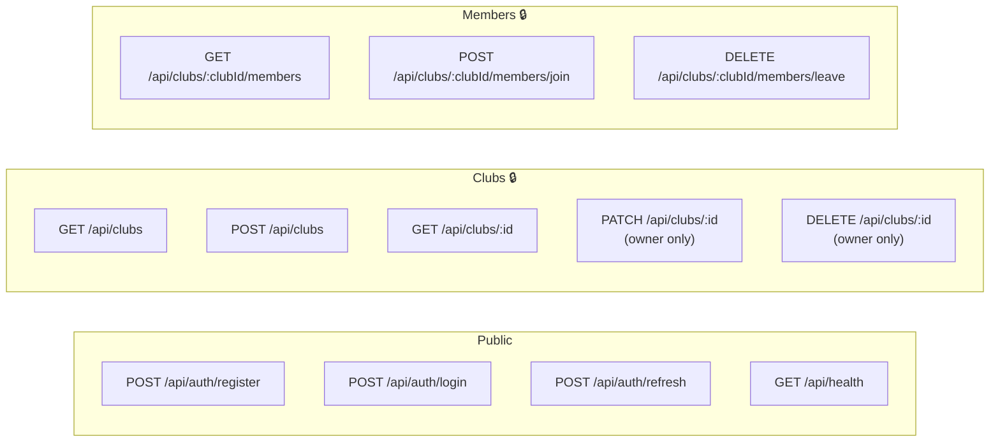
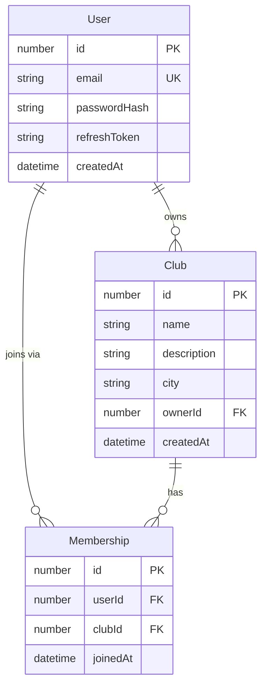
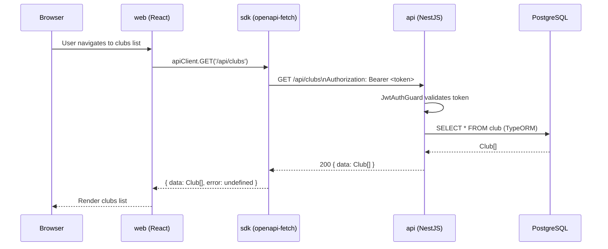

# Club Manager — Architecture Diagrams

Four diagrams to orient you in the codebase and trace any feature from UI to database.

---

## 1. Workspace Dependency Graph

Who depends on whom across the monorepo.

**Key rule:** `sdk` is auto-generated from `api/openapi.json` — never edit `packages/sdk/src/schema.ts` by hand.
Regenerate with: `pnpm generate:sdk`

---

## 2. API Route Map

All REST endpoints. 🔒 = requires `Authorization: Bearer <token>`.

Controllers live in `apps/api/src/{auth,clubs,members}/`.
Swagger UI available at `http://localhost:3001/api/docs` during development.

---

## 3. Entity-Relationship Diagram

Database models managed by TypeORM (`apps/api/src/**/entities/`).

---

## 4. Request Data-Flow

End-to-end journey of a protected API call (e.g. "list clubs").

Auth token is injected globally via `setAuthToken(token)` from `@club-manager/sdk`.
